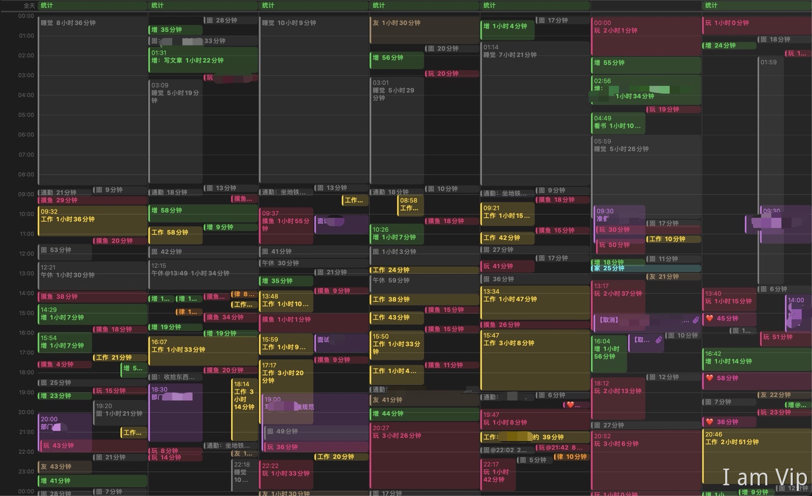

# LifeLog's Codes

我利用 iPhone 自带的备忘录、快捷指令、日历，这三个 app 来实现记录我的时间支出。  
详情可以参考[《总说自己没时间？我用一台iPhone给自己做了这个东西》](https://www.yuque.com/wetoria/essays/ln64gg)

目前实现了记录，并将数据保存至 iCloud 中。  
未来将会增加一些统计功能，这个仓库正是用来存放这部分的代码。